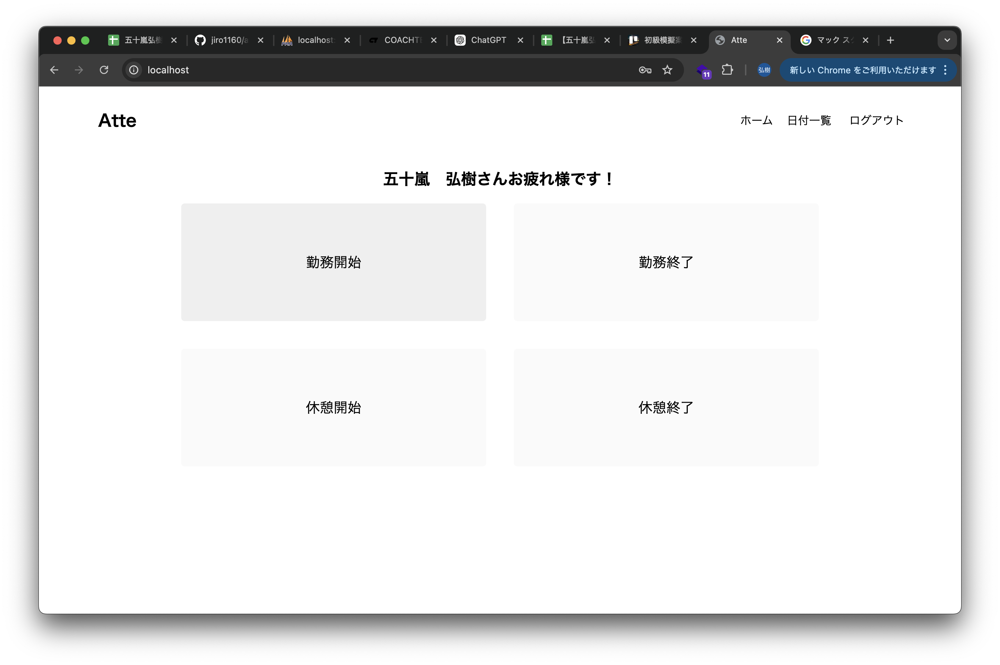
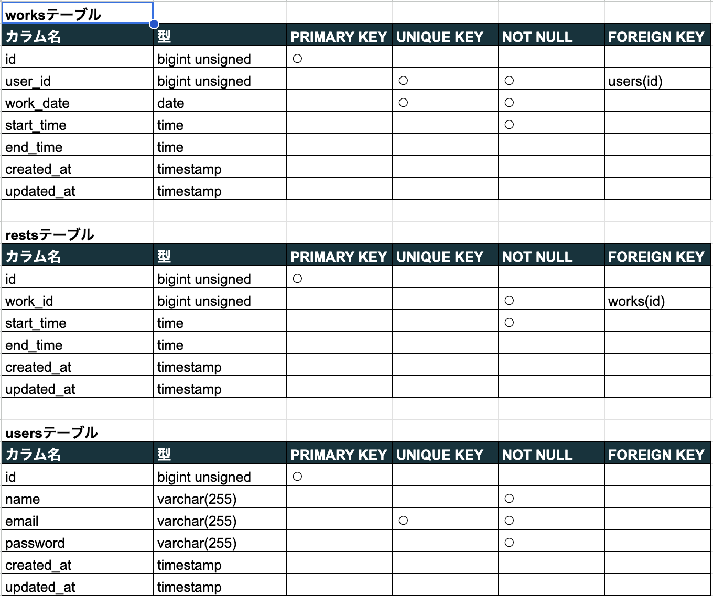
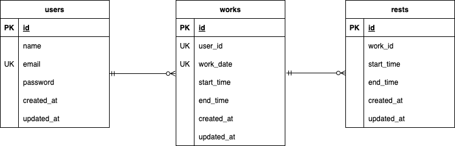

# atte
勤怠管理システム


## 作成した目的
模擬案件を通して実践に近い開発経験をつむ

## 環境構築
**Docker ビルド**

1. `git clone git@github.com:jiro1160/atte2.git`
2. DockerDesktop アプリを立ち上げる
3. `docker-compose up -d --build`

**Laravel 環境構築**

1. `docker-compose exec php bash`
2. `composer install`
3. 「.env.example」ファイルを 「.env」ファイルに命名を変更。または、新しく.env ファイルを作成
4. .env に以下の環境変数を追加

```text
DB_CONNECTION=mysql
DB_HOST=mysql
DB_PORT=3306
DB_DATABASE=laravel_db
DB_USERNAME=laravel_user
DB_PASSWORD=laravel_pass
```

5. アプリケーションキーの作成

```bash
php artisan key:generate
```

6. マイグレーションの実行

```bash
php artisan migrate
```

7. シーディングの実行

```bash
php artisan db:seed
```

## 使用技術(実行環境)

- PHP8.3.0
- Laravel8.83.27
- MySQL8.0.26

## 機能一覧
会員登録
ログイン
ログアウト
勤務開始
勤務終了
休憩開始
休憩終了
日付別勤怠情報取得
ページネーション

## テーブル設計


## ER 図


## URL
- 開発環境：http://localhost/
- phpMyAdmin:：http://localhost:8080/
